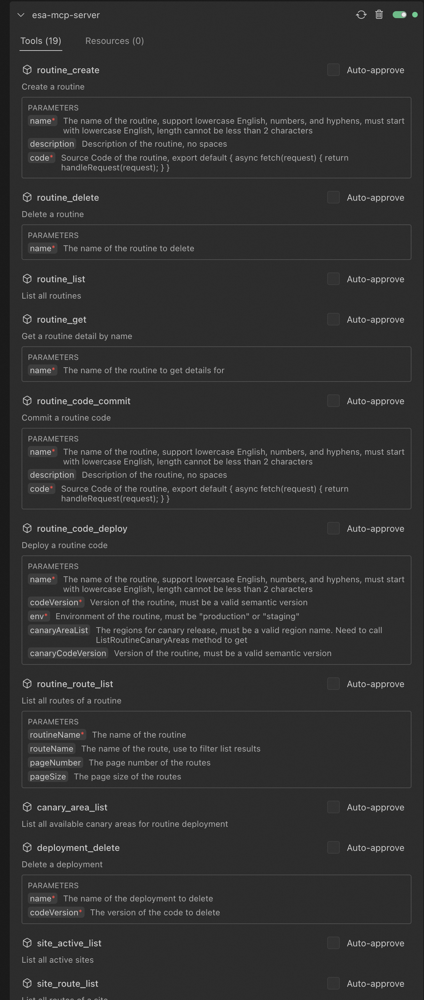
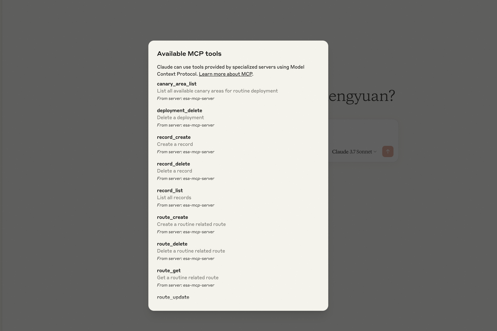

# ESA MCP 服务器

**ESA MCP 服务器是一个 Model Context Protocol (MCP) 服务器实现，用于实现 AI 模型与边缘安全加速(ESA)服务之间的通信。该服务器充当桥梁，允许模型通过标准化协议利用 ESA 功能。**

## 安装

**在支持MCP server的client配置文件中**

```
{
  "mcpServers": {
    "esa-mcp-server": {
      "command": "npx",
      "args": ["-y", "mcp-server-esa"],
      "env": {
        "ESA_ACCESS_KEY_ID": "your AK",
        "ESA_ACCESS_KEY_SECRET": "your SK"
      }
    }
  }
}


```

## 演示视频

**Claude演示视频**


**cline演示视频**


Client配置成功后界面



Claude配置成功后界面



## 功能特点

- **实现了用于工具执行的 Model Context Protocol**
- **提供对 ESA OpenAPI 服务的访问**
- **通过标准输入/输出 (stdio) 作为服务器运行，以便与模型运行器无缝集成**

## 工具列表

服务器提供以下 ESA 工具，可以通过 MCP 协议调用：

### Routine 管理工具

#### routine_create

**创建一个 Routine**

| 参数        | 类型   | 是否必需 | 描述                                                                                               |
| ----------- | ------ | -------- | -------------------------------------------------------------------------------------------------- |
| name        | string | 是       | Routine 名称，支持小写英文、数字和连字符，必须以小写英文开头，长度不少于 2 个字符                  |
| description | string | 否       | Routine 描述，不含空格                                                                             |
| code        | string | 是       | Routine 源代码，例如：`export default { async fetch(request) { return handleRequest(request); } }` |

#### routine_delete

**删除一个 Routine**

| 参数 | 类型   | 是否必需 | 描述                  |
| ---- | ------ | -------- | --------------------- |
| name | string | 是       | 要删除的 Routine 名称 |

#### routine_list

**列出所有 Routine**

无需参数。

#### routine_get

**获取 Routine 详情**

| 参数 | 类型   | 是否必需 | 描述                      |
| ---- | ------ | -------- | ------------------------- |
| name | string | 是       | 要获取详情的 Routine 名称 |

### 部署工具

#### routine_code_commit

**提交 Routine 代码**

| 参数 | 类型   | 是否必需 | 描述           |
| ---- | ------ | -------- | -------------- |
| name | string | 是       | Routine 名称   |
| code | string | 是       | Routine 源代码 |

#### routine_code_deploy

**部署 Routine 代码**

| 参数              | 类型   | 是否必需 | 描述                                                                     |
| ----------------- | ------ | -------- | ------------------------------------------------------------------------ |
| name              | string | 是       | Routine 名称                                                             |
| codeVersion       | string | 是       | Routine 版本，必须是有效的语义化版本                                     |
| env               | string | 是       | Routine 环境，必须是 "production" 或 "staging"                           |
| canaryAreaList    | array  | 否       | 金丝雀发布区域，必须是有效的区域名称，需要调用 canary_area_list 方法获取 |
| canaryCodeVersion | string | 否       | 金丝雀版本，必须是有效的语义化版本                                       |

#### canary_area_list

**列出所有可用于 Routine 部署的金丝雀区域**

无需参数。

#### deployment_delete

**删除部署**

| 参数 | 类型   | 是否必需 | 描述     |
| ---- | ------ | -------- | -------- |
| name | string | 是       | 部署名称 |

### 路由管理工具

#### route_create

**创建与 Routine 相关的路由**

| 参数        | 类型   | 是否必需       | 描述                                          |
| ----------- | ------ | -------------- | --------------------------------------------- |
| siteId      | number | 是             | 站点 ID                                       |
| mode        | string | 是             | 路由模式，可选 'simple' 或 'custom'           |
| route       | string | 根据 mode 而定 | 路由路径，如果 mode 是 'simple'，则必填       |
| rule        | string | 是             | 路由规则，如果 mode 是 'custom'，则必填       |
| routineName | string | 是             | Routine 名称                                  |
| routeName   | string | 是             | 路由名称，用于标识路由                        |
| bypass      | string | 是             | 路由旁路，可选 'on' 或 'off'，默认为 'off'    |
| routeEnable | string | 是             | 路由启用状态，可选 'on' 或 'off'，默认为 'on' |
| sequence    | number | 否             | 路由序列，默认为当前路由数量                  |

#### route_update

**更新与 Routine 相关的路由**

| 参数        | 类型   | 是否必需 | 描述                             |
| ----------- | ------ | -------- | -------------------------------- |
| siteId      | number | 是       | 站点 ID                          |
| configId    | number | 是       | 配置 ID                          |
| routeName   | string | 是       | 路由名称                         |
| routeEnable | string | 是       | 路由启用状态，可选 'on' 或 'off' |
| rule        | string | 是       | 路由规则                         |
| routineName | string | 是       | Routine 名称                     |
| bypass      | string | 是       | 路由旁路，可选 'on' 或 'off'     |
| sequence    | number | 否       | 路由序列                         |

#### route_delete

**删除与 Routine 相关的路由**

| 参数     | 类型   | 是否必需 | 描述    |
| -------- | ------ | -------- | ------- |
| siteId   | number | 是       | 站点 ID |
| configId | number | 是       | 配置 ID |

#### route_get

**获取与 Routine 相关的路由**

| 参数     | 类型   | 是否必需 | 描述    |
| -------- | ------ | -------- | ------- |
| siteId   | number | 是       | 站点 ID |
| configId | number | 是       | 配置 ID |

#### routine_route_list

**列出 Routine 的所有路由**

| 参数        | 类型   | 是否必需 | 描述                       |
| ----------- | ------ | -------- | -------------------------- |
| routineName | string | 是       | Routine 名称               |
| routeName   | string | 否       | 路由名称，用于过滤列表结果 |
| pageNumber  | number | 否       | 路由页码                   |
| pageSize    | number | 否       | 每页路由数量               |

#### site_route_list

**列出站点的所有路由**

| 参数       | 类型   | 是否必需 | 描述                       |
| ---------- | ------ | -------- | -------------------------- |
| siteId     | number | 是       | 站点 ID                    |
| routeName  | string | 否       | 路由名称，用于过滤列表结果 |
| pageNumber | number | 否       | 路由页码                   |
| pageSize   | number | 否       | 每页路由数量               |

### 记录管理工具

#### record_create

**创建记录**

| 参数  | 类型   | 是否必需 | 描述   |
| ----- | ------ | -------- | ------ |
| key   | string | 是       | 记录键 |
| value | string | 是       | 记录值 |

#### record_delete

**删除记录**

| 参数 | 类型   | 是否必需 | 描述           |
| ---- | ------ | -------- | -------------- |
| key  | string | 是       | 要删除的记录键 |

#### record_list

**列出所有记录**

无需参数。

### 站点工具

#### site_active_list

**列出活跃站点**

无需参数。

#### site_match

**匹配站点**

| 参数   | 类型   | 是否必需 | 描述         |
| ------ | ------ | -------- | ------------ |
| domain | string | 是       | 要匹配的域名 |

## 可用脚本

- `npm run build` - 使用 rslib 构建项目
- `npm run dev` - 以监视模式运行构建用于开发
- `npm run format` - 使用 Prettier 格式化代码
- `npm run lint` - 使用 ESLint 检查代码

### 项目结构

- `src/index.ts` - 主入口点
- `src/tools/` - ESA 工具实现
- `src/utils/` - 实用函数和辅助程序

## 许可证

**ISC**

## 贡献

**对于阿里巴巴的内部贡献者，请遵循项目的标准贡献工作流程。**
