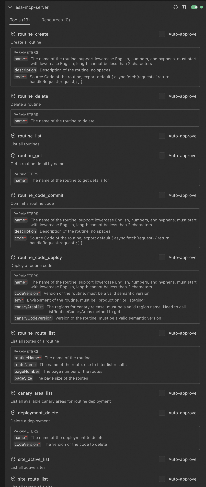
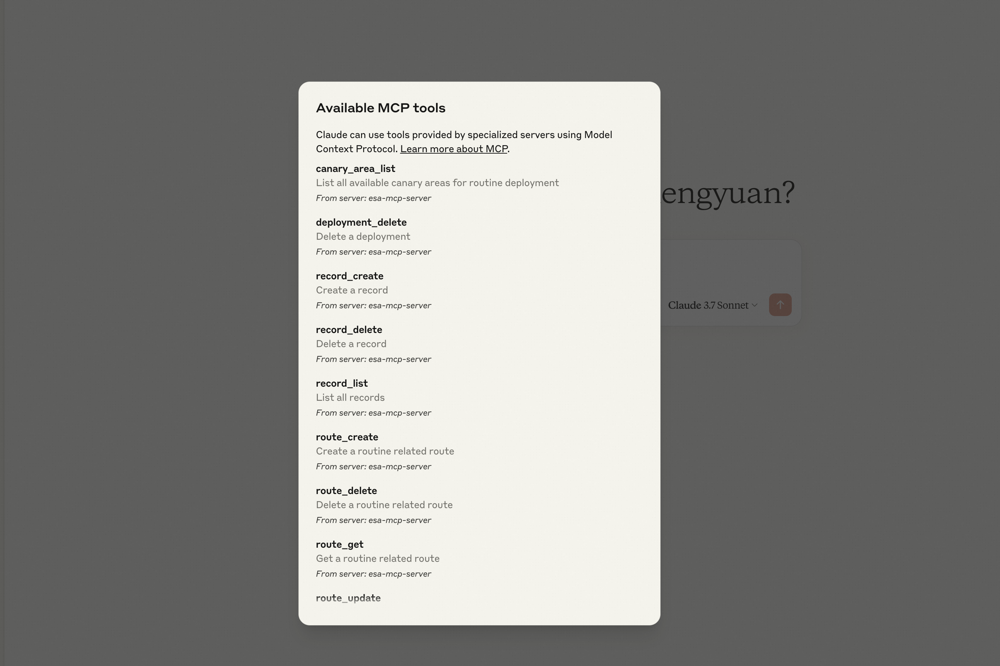

# ESA MCP Server

一个MCP服务器，简化对阿里云ESA多种服务的调用

---

[English](./readme.md) | [中文](./readme_zh.md)

## 安装

1. **在 Accesskey 页面申请阿里云的 AK 和 SK**

   https://ram.console.aliyun.com/profile/access-keys

2. **开通边缘函数服务**

   https://esa.console.aliyun.com/edge/function/list

3. **在支持 MCP 的客户端配置中进行设置：**

```json
{
  "mcpServers": {
    "esa-mcp-server": {
      "command": "npx",
      "args": ["-y", "mcp-server-esa"],
      "env": {
        "ALIBABA_CLOUD_ACCESS_KEY_ID": "your AK",
        "ALIBABA_CLOUD_ACCESS_KEY_SECRET": "your SK",
        "ALIBABA_CLOUD_SECURITY_TOKEN": "sts_security_token optional, required when using STS Token (默认不需要传)"
      }
    }
  }
}
```

## 演示视频

**Claude 演示**


**Cline 演示**


**Cline 配置成功：**



**Claude 配置成功：**



## 工具列表

**服务器提供以下可通过 MCP 协议调用的 ESA 工具：**

| 类别         | 工具                         | 描述                                                   |
| ------------ | ---------------------------- | ------------------------------------------------------ |
| **HTML**     | html_deploy                  | 快速部署一个HTML到新的边缘函数（ER）                   |
| **边缘函数** | routine_create               | 在你的阿里云账户中创建新的边缘函数（ER）。             |
|              | routine_delete               | 从你的阿里云账户中删除现有的边缘函数（ER）。           |
|              | routine_list                 | 列出你的阿里云账户中的所有边缘函数（ER）。             |
|              | routine_get                  | 获取特定边缘函数（ER）的详细信息。                     |
| **部署**     | routine_code_commit          | 在边缘函数（ER）中保存代码版本以供后续修改或发布使用。 |
|              | routine_code_deploy          | 将选定的代码版本部署到测试或生产环境。                 |
|              | deployment_delete            | 删除与边缘函数（ER）相关的指定代码版本。               |
| **路由**     | route_create                 | 创建与边缘函数（ER）相关的新路由。                     |
|              | route_update                 | 修改现有边缘函数路由的配置。                           |
|              | route_delete                 | 删除与边缘函数（ER）相关的指定路由。                   |
|              | route_get                    | 获取与边缘函数（ER）相关的特定路由的详细信息。         |
|              | routine_route_list           | 列出与特定边缘函数（ER）相关的所有路由。               |
|              | site_route_list              | 列出与特定站点相关的所有路由。                         |
| **记录**     | er_record_create             | 创建与边缘函数（ER）相关的新记录。                     |
|              | er_record_delete             | 删除与边缘函数（ER）相关的指定记录。                   |
|              | er_record_list               | 列出与特定边缘函数（ER）相关的所有记录。               |
| **站点**      | create_site                  | 让用户创建一个新的站点。                               |
|              | check_site_name             | 预校验一个站点名称是否可用。                  |
|              | verify_site             | 校验站点归属，通过校验的站点将自动被激活。                  |
|              | get_site             | 根据站点ID查询单个站点信息。               |
|              | list_sites             | 用于查询当前用户下的站点列表 ，包括站点的名称、状态、配置等信息。                   |
|              | delete_site             | 根据站点ID删除一个站点。                |
|              | update_site_coverage             | 修改单个站点的加速区域。更新站点的加速配置，以适应流量分布变化或提升特定地区用户的访问体验。                   |
|              | site_active_list             | 列出你的阿里云账户中所有激活的站点。                   |
|              | site_match                   | 识别账户中与提供的输入条件匹配的站点。                 |
|              | site_record_list             | 列出与特定站点相关的所有 DNS 记录。                    |
|              | create_site_a_or_aaaa_record | 在站点下创建一条 A/AAAA 类型的 DNS 解析记录。          |
|              | create_site_cname_record     | 在站点下创建一条 CNAME 类型的 DNS 解析记录。           |
|              | create_site_txt_record       | 在站点下创建一条 TXT 类型的 DNS 解析记录。             |
|              | create_site_ns_record        | 在站点下创建一条 NS 类型的 DNS 解析记录。              |
|              | create_site_mx_record        | 在站点下创建一条 MX 类型的 DNS 解析记录。              |
|              | get_site_pause               | 查询站点暂停配置。                                     |
|              | update_site_pause            | 修改站点暂停配置。                                     |
|              | create_site                  | 让用户创建一个新的站点。                               |
| **DevelopmentMode**       | get_development_mode                  | 查询站点开发模式配置。                      |
|      | update_development_mode                 | 修改站点开发模式配置。功能开启的情况下，能够让所有请求都绕过边缘节点上的缓存组件，直接传递到源服务器，以便于能够实时查看源站服务器上的最新资源。 |
## Prompt示例

- 编写一个 2048 游戏并将其部署在边缘函数上，显示边缘函数提供的默认访问 URL。
- 删除 2025 年 5 月之后创建的边缘函数。
- 列出我的账户下的所有边缘函数。
- 我的边缘函数“hello-world”的默认访问地址是什么？
- 为 `test.example.com` 创建一个 CNAME 记录，值设置为 `example2.com`。
- 为 `test.example.com` 创建一个 A 记录，值设置为 `1.1.1.1`。
- 编写一个五子棋HTML到ER中。
- 帮我查一下www.example.com，是不是一个可以添加到ESA里的合法域名。
- 帮我看一下，站点xxx是否通过了归属验证。
- 帮我查看一下站点xxx的开发者模式配置。
- 帮我关闭站点xxx的开发者模式。

## 许可证

MIT
